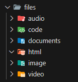

# File Organizer: A Modern TypeScript Project Template

A scalable, maintainable, and modular TypeScript project setup with a clean file structure and modern development practices.

---

##  Preview



--- 

## 📁 Project Structure

```
src/
├── assets/          # Static assets (images, icons, etc.)
├── config/          # App configuration and constants
├── features/        # Feature-based modules (e.g., auth, user, product)
│   ├── auth/
│   │   ├── components/
│   │   ├── hooks/
│   │   ├── services/
│   │   ├── types/
│   │   └── index.ts
├── shared/          # Reusable UI components and utilities
├── hooks/           # Global custom hooks
├── types/           # Global TypeScript types and interfaces
├── utils/           # Helper functions and utilities
├── services/        # Global API services or clients
└── index.ts         # App entry point
```

---

## 🛠️ Features

-  Feature-based folder structure
-  Barrel exports for simplified imports
-  Type-safe and modular architecture
-  Centralized config management
-  Easy scalability and team collaboration

---

##  Getting Started

### 1. Clone the Repository

```bash
git clone https://github.com/your-username/your-repo.git
cd your-repo
```

### 2. Install Dependencies

```bash
npm install
# or
yarn install
```

### 3. Run the App

```bash
npm run dev
# or
yarn dev
```

---

##  Scripts

| Script          | Description                   |
|-----------------|-------------------------------|
| `dev`           | Run in development mode       |
| `build`         | Build for production          |
| `lint`          | Run ESLint                    |
| `format`        | Format code with Prettier     |
| `type-check`    | Run TypeScript type checking  |

---

##  Tech Stack

- **TypeScript**
- (Add others like React, Node.js, Vite, Express, etc. based on your stack)

---

##  Recommended Extensions

- ESLint
- Prettier
- Path Intellisense
- TypeScript Hero (for auto imports)

---

##  Contributing

Contributions are welcome! Please open issues or pull requests.

---


